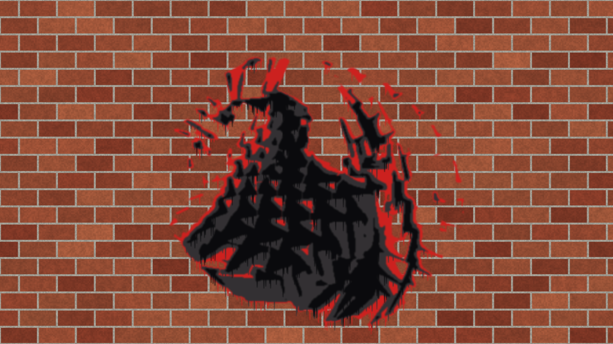
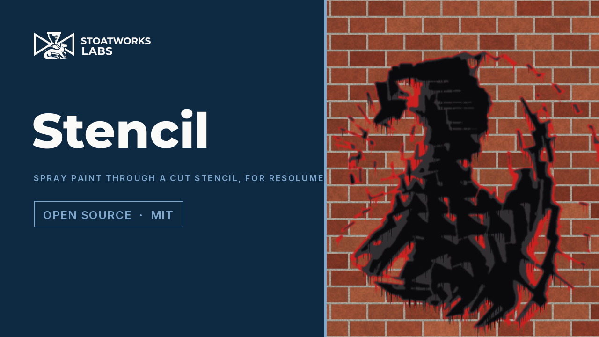

# stencil

> **AI-assisted project.** This codebase was created with [Claude](https://claude.com/claude-code)
> (Anthropic), directed and reviewed by a human author. The stencil is not asserted but
> measured: an offline harness drives the real plugin class in a headless GL context and
> reads every property back out of what it renders, with geometry of its own — after
> bridging, a flood-fill labelling of the output finds no piece of sheet cut off from the
> frame's edge on letters, rings four deep, squares in squares and random blobs; every
> bridge is exactly the shortest gap from its island to another piece, against brute
> force over boundary cells; a bridge across a gap is exactly 2⌊W/2⌋ + 1 cells wide
> square to it, and a thin diagonal one stays 4-connected; the paint across a straight
> edge is the chord fraction of the nozzle's disc to within one half-float ulp; n layers
> give n + 1 plateaus in their inks, darkest on top; a picture panned by whole cells gets
> the same bridges translated; and a resize keeps last frame's bridges — with a negative
> control that proves each check can fail, all of it at two rasters and on Apple's
> software renderer. It has **never been loaded into Resolume**; it is loaded by
> [oxbow](https://github.com/stoatworks-labs/oxbow), which is a real FFGL host and is not
> Resolume. See [Status](#status).

Spray paint through a cut stencil, as an FFGL effect for [Resolume](https://resolume.com)
Arena and Avenue.



<sub>One frame, rendered by `sntest --pipe`, the offline harness — not captured from
Resolume. Resolume's bundled demo clip Metalive 01 with three layers of the Street cans on
the Brick wall.</sub>

<!-- downloads:start -->

## Download

**[v0.1.0](https://github.com/stoatworks-labs/stencil/releases/tag/v0.1.0)** — prebuilt for macOS and Windows. Pick your platform:

<details>
<summary><b>macOS</b> — Universal (Apple Silicon + Intel)</summary>

| Build | Download | Size |
| --- | --- | --- |
| Universal (Apple Silicon + Intel) · .dmg disk image | [`stencil-0.1.0-macos-universal.dmg`](https://github.com/stoatworks-labs/stencil/releases/download/v0.1.0/stencil-0.1.0-macos-universal.dmg) | 270 KB |
| Universal (Apple Silicon + Intel) · .zip archive | [`stencil-macos-universal.zip`](https://github.com/stoatworks-labs/stencil/releases/latest/download/stencil-macos-universal.zip) | 228 KB |

</details>

<details>
<summary><b>Windows</b> — x64</summary>

| Build | Download | Size |
| --- | --- | --- |
| x64 · .exe installer | [`stencil-0.1.0-windows-x86_64-setup.exe`](https://github.com/stoatworks-labs/stencil/releases/download/v0.1.0/stencil-0.1.0-windows-x86_64-setup.exe) | 238 KB |
| x64 · .zip archive | [`stencil-windows-x86_64.zip`](https://github.com/stoatworks-labs/stencil/releases/latest/download/stencil-windows-x86_64.zip) | 132 KB |

</details>

All builds, checksums and release notes: [github.com/stoatworks-labs/stencil/releases](https://github.com/stoatworks-labs/stencil/releases).

macOS builds are signed and notarised and open normally. The Windows builds are unsigned, so SmartScreen warns once.

<!-- downloads:end -->

## Video

[](https://www.youtube.com/watch?v=T6u7w-wOPwk)

## The one idea

A stencil is a sheet with holes cut in it, and paint goes through the holes. **A stencil
cannot hold a floating piece.** The middle of an O, the counter of an A, an island of
light inside a shadow — cut them out and they fall out. So a cutter leaves **bridges**,
thin strips of sheet that tie every island to the rest. Then the paint is sprayed from a
nozzle at a distance, and some of it creeps under the edges of the sheet.

So the clip's tone is cut at one to four thresholds, and each layer's sheet is labelled
into pieces. Every piece that does not reach the frame's edge is an island, and gets the
shortest bridge there is from it to any other piece, found by a jump flood that carries
two seeds a texel: the nearest sheet, and the nearest sheet of a *different* piece. An
island bridged to another island still floats, so it goes round again until nothing does.
Then the paint is the hole convolved with the nozzle's footprint.

## What falls out

None of these is drawn. Each is the stencil doing what stencils do:

- **The gap in the O.** Every enclosed shape is broken where its ring is thinnest, because
  that is where the shortest bridge is — the split letters, the segmented shadows, the
  rings of a target with one spoke each.
- **Islands inside islands.** A ring inside a ring inside a ring: each one is tied to its
  nearest neighbour, and pieces that were only tied to each other are tied on again, until
  everything hangs off the frame.
- **Layers, dark over light.** Each layer is its own stencil, sprayed lightest first, so
  the darker cuts land on top and n layers give n + 1 tones including the bare wall. Each
  layer has its own bridges, and a dark layer's bridge shows the lighter paint beneath it.
- **The halo.** A nozzle further away sprays a wider cone, so the paint fades across every
  edge over a distance in proportion to it — the fraction of a disc on one side of a line.
- **Creep under lifted sheet.** A stencil never lies quite flat. Paint gets under every
  edge a little and under a bridge most, because a bridge is a thin strip that lifts, so
  bridges read as ghostly lines rather than clean gaps when Lift is up.
- **Drips.** Where more paint lands than the wall can hold, the excess runs down from the
  lower edges in a few columns.

### The honest limit

The stencil is cut on a lattice of at most 540 rows (at 4K every texel is four pixels), so
with the spray at its sharpest the edges step. A bridge is always a straight strip and
always the shortest; a real cutter also bridges for strength, and would add a second
bridge to a big island, which this never does. Every island gets exactly one bridge per
pass. Bridges from the previous frame are kept while they stay within a texel of the
shortest, so on a still clip they hold still; on a panning clip they hold still in the
*frame* until they fall behind, then step. The drips are static — they appear with the
paint rather than running over time. The inks are opaque, never mixed.

## Controls

| Group | |
| --- | --- |
| **Cut** | Layers (1–4), Threshold (the lightest cut; the layers divide the tones under it evenly), Invert (paint the light instead of the dark), Smooth (a blur before cutting), Bridge Width (0.1–2% of the frame height), Min Island (islands smaller than this square are dropped and painted, as a cutter drops a speck). |
| **Spray** | Distance (the nozzle's footprint through an edge, 0–2% of the frame height), Pressure (paint laid, 0–2; over 0.9 it drips), Lift (paint under the sheet, most under bridges), Drips. |
| **Paint** | Palette (Mono, Street, Sepia, Pop, Cool: n layers take the darkest n cans), Layer Colours (the palette, or each layer's mean colour in the clip), Wall (the clip itself, brick, concrete, plain), Mix. |

The defaults are two layers of the Mono cans on concrete, cut at half tone with a little
smoothing, bridges half a percent of the frame high, specks under 1.2% dropped, sprayed
from close in with a little lift and a few drips. Chosen on Resolume's demo clips.

**Alpha.** A transparent part of the clip is bare wall: it is never painted, with Invert
on or off. With a brick, concrete or plain wall the output is opaque at Mix 1 — the wall
covers the whole frame. With Wall set to Clip the clip's own alpha is kept where no paint
landed, and paint is opaque where it did.

## Status

**v0.1.0, released 25 September 2026, and honestly early.** There is a
[user guide](https://stoatworks-labs.com/software/stencil/guide/) and a
[project page](https://stoatworks-labs.com/software/stencil/).

### Measured offline, on macOS

`tools/verify.sh` passes on this machine (M4 Max, macOS 26.4) against a fresh universal
Release build, running every check at 320×180 and 1280×720 and again on Apple's software
renderer, which is what a GPU-less CI runner has; the geometry checks passed at 1920×1080
and 333×187 by hand. What it establishes:

- **No island floats.** On the letters O A B 8 (6 islands), rings nested four deep (4),
  squares in squares three deep (6) and random blobs (22 at 320×180, 23 at 720p), and
  three layers of smoothed blobs (62 and 67), the harness's own flood fill of the output
  finds 0 pieces of sheet cut off from the frame. The plugin found exactly the islands the
  harness counts in the input. Passes: 1 for everything but the nested rings, which take
  3, within the bound of ⌊log₂ F⌋ + 1.
- **Every bridge is the shortest.** 39 bridges at 320×180 and 40 at 720p, every one exactly the
  brute-force shortest gap of its pass (the spec allows a texel; none needed it). With
  last frame's bridges kept on a slow pan, a kept bridge was at most 1.000 texel longer
  than the shortest, which is what keeping allows.
- **Width.** Square to a gap, 2⌊W/2⌋ + 1 cells exactly, read off the output (1, 3 at
  320×180; 3, 7 at 720p; 5, 11 at 1080p). At 45°, 2⌊W/√2⌋ + 1 exactly, and a bridge thinner
  than a cell stays 4-connected.
- **Overspray.** Across a straight edge the paint is the chord fraction of a disc of the
  footprint's radius within 4.9e-4 (one half-float ulp; allowed 4.9e-4 to 5.2e-4), and its
  25–75% width doubles with Distance (1.905× at 320×180 for 2×, where the footprint is 1.8
  and 3.6 texels; 1.993× at 1080p).
- **Layers.** 1 to 4 layers give 2 to 5 plateaus in order, darkest ink first, every
  decidable pixel exactly its ink.
- **Stability.** Panned a whole texel a frame, the square ring, the letters and the nested
  rings get the first frame's bridges translated on every frame. Panned 0.2 px a frame for
  60 frames, 6.8% / 5.1% / 2.8% of bridges change from one frame to the next at 320×180
  keeping last frame's bridges (letters, nested rings, blobs), against 74% / 90% / 9.5%
  without; 7.1% / 1.3% / 0.9% against 48% / 90% / 2.2% at 720p.
- **Resize.** A resize mid-run keeps last frame's bridges where a fresh instance would
  choose differently.
- **Negative controls.** No bridges fails the islands; bridging straight up fails the
  shortest; a band twice as wide, and a thin diagonal without its connectivity floor, fail
  the width; a Gaussian footprint of the same quartile width fails the overspray; painting
  darkest first fails the layers; ties broken toward the frame's centre fail the
  stability; ignoring, or a resize forgetting, last frame's bridges fails the resize.
- **No dead controls**: all 14 change the picture.
- **The bundle** is universal, and oxbow sees `SW Stencil`, `SN01`, an effect, and renders
  120 frames through it.

Render cost, `sntest --bench` (the defaults on the bench scene of blobs through letters,
two layers, about 47 islands, best of three runs of 30 frames, `glFinish` both sides). This
Mac was busy with other work throughout — an ffmpeg encode on twelve cores, a VM, other
plugins' harnesses on the same GPU — so the same bench moved by a factor of two between
runs; the range is every run of the final build, the best first:

| | lattice | ms/frame | the floods | the cutter (CPU) |
| --- | --- | --- | --- | --- |
| 1280×720 | 640×360 | 7.4–20 | 2.7–8.6 | 1.9–4.4 |
| 1920×1080 | 960×540 | 13–26 | 4.2–8.4 | 3.8–6.5 |
| 3840×2160 | 960×540 | 22 (one run) | 8.4 | 6.0 |

The bridging is most of it: the floods (every pass of every layer, with the label upload
and the readback stall) and the cutter on the CPU. A labelling of one layer on its own is
0.13 ms at 640×360 and 0.27 ms at 960×540, and the passes after the first flood a quarter
of a grid. The lattice stops at 540 rows, so 4K costs what 1080p does but the composite.
This is not cheap: at 1080p it is most of a 60 fps frame even at its best here, and more
layers or more islands cost more. Before the cutter was reworked it was 33 ms at 1080p.

Measured again for the release on a quieter moment (three runs each): the bench scene at the
defaults 9.5–11.4 ms at 720p, 14.9–16.3 ms at 1080p, 15.4–17.0 ms at 4K; one layer 7.8–9.1 ms
and four layers 31–33 ms at 1080p. On Resolume's demo clips at 1080p through `--pipe`, less the
harness's own frame input and output (~9 ms, measured by putting the bench scene through both
ways): the skulls about 22 ms (one layer about 12), the sphere about 14 (7), three rings about
9 (5). **The default stays at two layers**: one layer would be cheaper, but every palette's
darkest can is a near-black, so Palette would do almost nothing and the dark-over-light tones
would go; the user guide says how to make it cheaper.

### In Resolume

**In Resolume Arena 7.27.1 on Windows** (win-lab, software rendering, no GPU): the DLL
release.yml built loads, registers as `SW Stencil` / `SN01` / effect, all 20 host controls match
the declaration, it renders, Arena's log stays clean, and all 14 valued controls plus Opacity
move the picture: 9 of 9 of the fleet's Arena gate, one run. The gate's picture is a still, and
software rendering says nothing about speed.

### Not done

- **Never loaded into Resolume on macOS.**
- Seen only on six of Resolume's bundled demo clips, never on camera footage.
- No OpenFX port, no factory presets.

## Try it in your browser

**[stencil-demo.stoatworks-labs.com](https://stencil-demo.stoatworks-labs.com/)** runs the
plugin's own shaders in WebGL2 — the jump flood that measures every bridge included — on
generated clips, with the plugin's own controls. It is a demo, not the plugin: the CPU
half, the union-find cutter in `Bridge.cpp`, is **ported to JavaScript** (`demo/cutter.js`),
and a port is checked only by a reader and by the one comparison against the C++ recorded
in [AGENTS.md](AGENTS.md#the-browser-demo). The page says what else it does not do.

## Build

Needs CMake 3.15+, a C++17 compiler and the FFGL SDK submodule.

```sh
git clone --recurse-submodules https://github.com/stoatworks-labs/stencil
cd stencil
cmake -B build -DCMAKE_BUILD_TYPE=Release
cmake --build build --parallel
```

The macOS bundle is universal (Apple Silicon and Intel). `cmake --install build` copies it
into `~/Documents/Resolume Arena/Extra Effects`; for Avenue, pass
`--prefix "$HOME/Documents/Resolume Avenue/Extra Effects"`.

## Building and testing

```sh
tools/verify.sh                                   # everything, about five minutes
./build/sntest --list                             # the parameters
./build/sntest --islands --size 320x180           # one check
./build/sntest --negative                         # every check can fail
SNTEST_RENDERER=software ./build/sntest --shortest   # on Apple's software renderer
python3 tools/sweep.py                            # no dead controls
ffmpeg -i clip.mov -f rawvideo -pix_fmt rgba - | ./build/sntest --pipe --size 1280x720 | ffplay -f rawvideo -pixel_format rgba -video_size 1280x720 -
```

`CLAUDE.md` is the command reference and `AGENTS.md` the reasoning: the cutter, the
traps, and where every tolerance comes from.

## License

MIT — see [LICENSE](LICENSE). What it builds on is in [ATTRIBUTIONS.md](ATTRIBUTIONS.md).

<!-- attributions:start -->
This project is built on other people's work — see [ATTRIBUTIONS.md](ATTRIBUTIONS.md).
<!-- attributions:end -->
